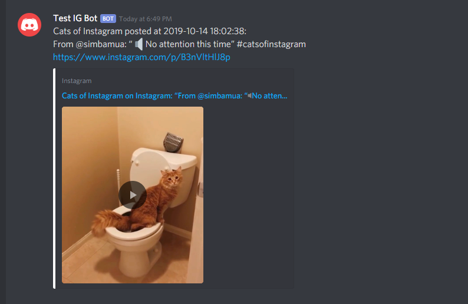

# Instagram-Discord Bot
An Instagram-Discord bot that provides notifications to Discord channels when a specified Instagram fan page makes a new post. The bot automatically checks for new posts at set intervals and when a new post is found, it will post to Discord the details & hyperlink to the Instagram page.

## Final Product

Example of Discord Bot Post

## Getting Started

1. Ensure Python 3.7 and `pipenv` are installed
2. Activate the virtual environment with `pipenv shell` inside the folder directory
3. Install the dependencies with `pipenv install`
4. Create the `.env` by using `.env.example` as a reference via `cp .env.example .env`
5. Update the `.env` with the following information:
- DISCORD_TOKEN: secret token of your Discord bot
- CHANNEL_NAME: name of the channel where the bot resides and where you want it to post updates
- INSTAGRAM_PAGE_URL: url address of the instagram account
6. Run the bot with `python app.py`

## Dependencies

- python 3.7
- pipenv
- beautifulsoup4
- requests
- discord-py
- asyncio
- python-dotenv

